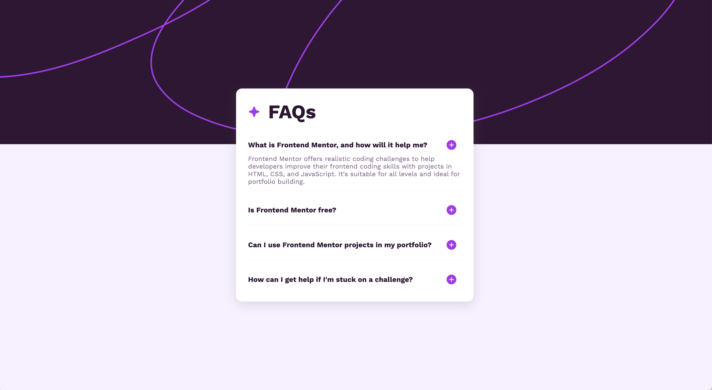
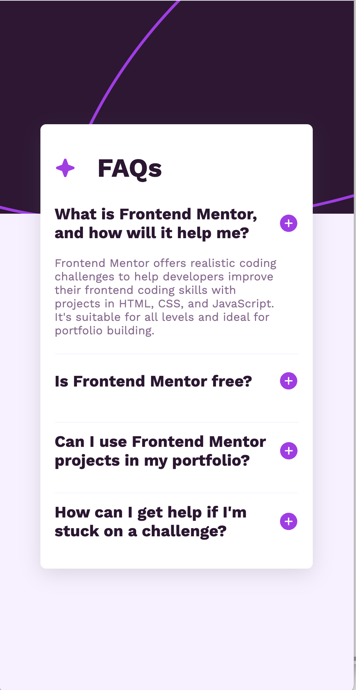
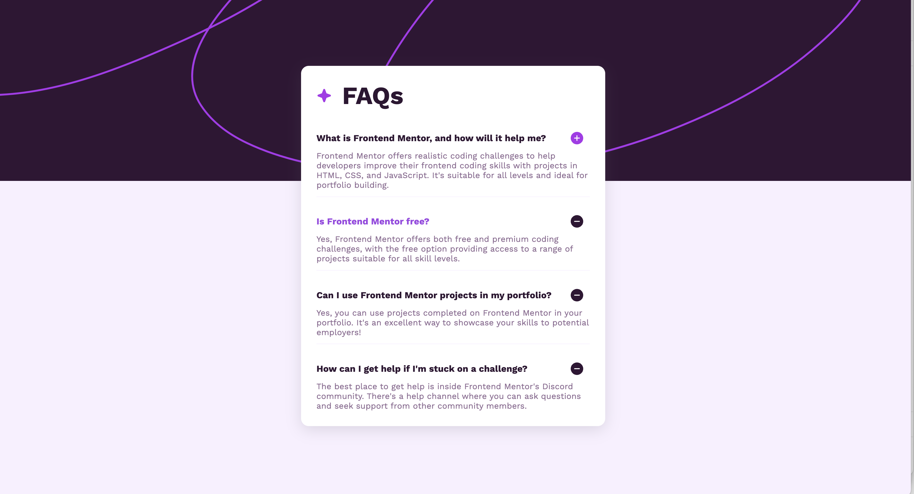

# Frontend Mentor - FAQ accordion solution 

## Table of contents

- [Overview](#overview)
  - [The challenge](#the-challenge)
  - [Screenshot](#screenshot)
  - [Links](#links)
- [My process](#my-process)
  - [Built with](#built-with)
  - [What I learned](#what-i-learned)
  - [Continued development](#continued-development)
  - [Useful resources](#useful-resources)
- [Author](#author)
- [Acknowledgments](#acknowledgments)

## Overview

### The challenge

Users should be able to:

- Hide/Show the answer to a question when the question is clicked
- Navigate the questions and hide/show answers using keyboard navigation alone
- View the optimal layout for the interface depending on their device's screen size
- See hover and focus states for all interactive elements on the page

### Screenshot





### Links

- Solution URL: [Solution](https://github.com/BKFOE/FAQaccordion.git)
- Live Site URL: [Live](https://bkfoe.github.io/FAQaccordion/)

## My process

### Built with

- Semantic HTML5 markup
- CSS custom properties
- jquery
- Bootstrap
- Javascript
- Flexbox

### What I learned

I wanted to be sure to follow proper semantics and add landmarks to my code. Additionally, I used bootstrap to create the accordion layout and created the onclick and keyboard press down functionality using Jquery. CSS property of relative and absolute positioning to layer the container on top of the background. I wanted to really work on eyeing the margin and padding by eye so the finishing details of this project took me a little longer. 

Jquery function for the show/ hide , see below:

```
$(document).ready(function() {
    $(".accordion-button").click(function() {

        // Toggle the collapsed class 
        $(this).toggleClass("collapsed");

        // Show or hide the paragraph based on the presence of the collapsed class 
        if($(this).hasClass("collapsed")) {
            $(this).closest(".accordion-item").find(".accordion-body").show();
        } else {
            $(this).closest(".accordion-item").find(".accordion-body").hide();
        }
    });
});
```
### Continued development

Learning css extension languages and frameworks for faster development

## Author

- Website - [Github](https://github.com/BKFOE)
- Frontend Mentor - [@bkfoe](https://www.frontendmentor.io/profile/BKFOE)

